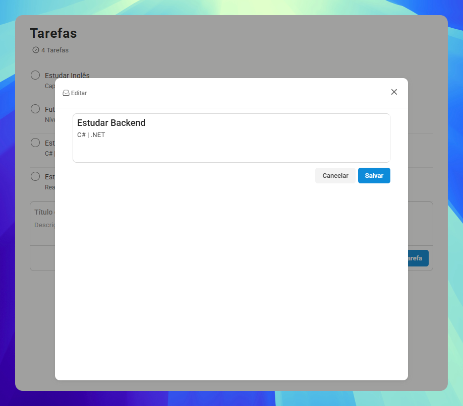

<h1 align="center" style="font-weight: bold;">Sistema de lembretes (CRUD React)</h1>

<p align="center">
    <b>A fim de facilitar minha rotina diária com organizações de tarefas e aprimorar minhas habilidades em React, realizei um sistema de lembretes totalmente funcional.</b>
</p>

<p align="center">
     <a href="https://lembretes-app.vercel.app/">Acesse o projeto</a>
</p>

<h2 id="layout">🎨 Layout</h2>

<p align="center">
    
    
</p>

<h2 id="technologies">💻 Tecnologias</h2>
<ul>
    <li>Node</li>
    <li>NPM</li>
    <li>React</li>
    <li>React Icons</li>
    <li>Vite</li>
    <li>ESLint</li>
</ul>

<h2 id="funcionalidades">🧠 Funcionalidades</h2>
<ul>
    <li>Adicionar Lembrete</li>
    <li>Remover Lembrete</li>
    <li>Duplicar Lembrete</li>
    <li>Editar Lembrete</li>
    <li>Feedback PopUp</li>
    <li>Marcar como concluido o lembrete</li>
    <li>Persistência local</li>
</ul>

<h2 id="melhorias">🔮 Futuras Melhorias</h2>
<p>Projeto em constante evolução.</p>
<ul>
    <li>( ) Implementar login (Autenticação de usuário).</li>
    <li>( ) Substituir LocalStorage por um banco de dados.</li>
    <li>( ) Adicionar datas de vencimento e notificações.</li>
    <li>( ) Permitir reordenar lembretes (Drag and Drop).</li>
    <li>( ) Adicionar categorias ou tags para os lembretes.</li>
    <li>( ) Modo Escuro (Dark Mode).</li>
</ul>

<h2 id="started">❓ Como rodar?</h2>

Sessão para demonstração de como rodar o projeto

<h3>Pre-requisitos</h3>
-NodeJs

<h3>Clonando</h3>

```bash
git clone https://github.com/NatanBraslavsky/lembretes_app
cd lembretes_app
npm install
npm run dev
```
